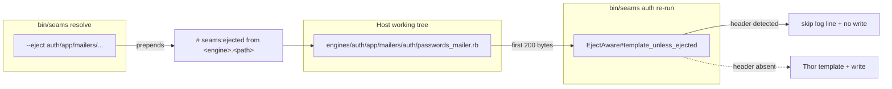

# Seams architecture — Wave 10 addendum

This document is an addendum to
[`ARCHITECTURE_WAVE_9.md`](ARCHITECTURE_WAVE_9.md). Read that one
first; it covers the engine inventory, the data model, and the
generator pipeline as they stood at the end of Wave 9.

Wave 10 doesn't change any of the runtime shapes. What it changes is
the **mental model** of how seams is used over time. Wave 9 left
seams as a one-shot scaffolder: `bin/seams auth` writes the engine
into the host, and from there the host owns it outright. That works
when seams is small, but it forces a binary choice as soon as a host
diverges from the gem version: keep using the generator and accept
overwrite, or stop using the generator and miss every later
improvement.

Wave 10 turns seams into a **spliceable framework**. Generated
engines now expose stable, named extension points; follow-up
generators target those points to add features without re-templating;
and the host can mark any single file as "I own this now" so the
canonical generator skips it on the next run.

The three pieces of new machinery:

1. **Insertion-point markers** — `# seams:insertion-point <name>`
   comments inside generated files, placed at exactly the points
   where adding-one-more is the natural extension. The full list
   lives in [`INSERTION_POINTS_CATALOGUE.md`](INSERTION_POINTS_CATALOGUE.md);
   the format spec is in [`INSERTION_POINTS.md`](INSERTION_POINTS.md).
2. **Follow-up generators** — net-new generators of the form
   `bin/rails generate seams:<engine>:<verb>_<noun>` that locate a
   marker by name and splice content under it, idempotently. The
   first showcase is `seams:auth:add_oauth_provider`. The authoring
   guide is [`WRITING_FOLLOW_UP_GENERATORS.md`](WRITING_FOLLOW_UP_GENERATORS.md).
3. **`bin/seams resolve`** — the documented escape hatch. Three
   sub-commands: `--eject <engine>/<file>` marks a host file as
   host-owned (subsequent regenerations skip it via the
   `template_unless_ejected` helper now wired into all six engine
   generators); `--list-markers <engine>` prints the marker
   inventory of a generated engine; `--list-ejected` surveys the
   working tree for ejected files.

Together they let seams ship new features as additive follow-up
generators against already-customised hosts, without forcing a
regeneration that would clobber host edits.

---

## The splice flow

When a host runs a follow-up generator, the path through the gem
looks like this:

```mermaid
sequenceDiagram
    autonumber
    participant Host as Host operator
    participant Rails as bin/rails generate
    participant Gen as Follow-up generator<br/>(subclass of FollowUpGenerator)
    participant Splicer as Seams::Generators::Splicer
    participant File as engines/&lt;engine&gt;/&lt;file&gt;

    Host->>Rails: seams:auth:add_oauth_provider linkedin
    Rails->>Gen: invoke_all
    Gen->>Splicer: find_marker(file_path, marker)
    Splicer->>File: read first N lines
    File-->>Splicer: line(s)
    alt marker absent
        Splicer-->>Gen: nil
        Gen-->>Host: Seams::GeneratorError<br/>"re-run bin/rails generate seams:&lt;engine&gt;"
    else marker present
        Splicer-->>Gen: { line_number, indent, marker }
        Gen->>Gen: template adapter.rb.tt + adapter_spec.rb.tt
        Gen->>Splicer: splice_after_marker(file_path, marker, content)
        Splicer->>File: read full file
        Splicer->>Splicer: idempotency check (50-line window)
        alt content already present
            Splicer-->>Gen: Result(ok?: true, lines_added: 0)
        else net-new content
            Splicer->>File: write merged content
            Splicer-->>Gen: Result(ok?: true, lines_added: N)
        end
        Gen-->>Host: green "splice  &lt;file&gt; @ &lt;marker&gt;" log
        Gen-->>Host: report_summary (next steps)
    end
```

The contract worth holding in your head:

- **Markers are looked up by name, never by line number.** A host
  can add unrelated lines above or below a marker; the marker keeps
  working as long as the comment line itself isn't deleted.
- **Idempotency is per-splice.** Re-splicing the same content under
  the same marker is a no-op (the splicer reads a 50-line window
  after the marker and skips the write if the snippet's already
  there). Cross-marker invariants are the generator's
  responsibility — fail fast in `assert_engine_present` if you
  splice into more than one place.
- **Indentation is auto-detected.** The Splicer reads the leading
  whitespace off the marker line and prepends it to every non-blank
  line of the spliced content. Follow-up generators don't have to
  know whether a marker sits at column 0, column 4, or column 6.
- **The Splicer is pure file I/O** — no Rails dep, no Thor — so
  `bin/seams resolve` can reuse it without booting Rails.

---

## The eject flow

Ejection is the symmetric escape hatch: when splicing isn't enough
because the host wants to fully rewrite a generator-owned file.



The `EjectAware` mixin is included in all six canonical engine
generators (auth, accounts, billing, core, notifications, teams).
Every `template` call in those generators now goes through
`template_unless_ejected`, which checks the destination's first 200
bytes for the eject header and short-circuits when present.

Eject-eligibility (the rule both `bin/seams resolve --eject` and the
generators agree on) is documented inline in
[`Seams::Generators::EjectAware`](../lib/seams/generators/eject_aware.rb).
The short version: anything under `app/`, `lib/`, `config/`, `spec/`
is eligible; migrations, `engine.rb`, `version.rb`, the Gemfile, and
the `.gemspec` are not.

---

## Why no end markers, no XML

A handful of design choices in the marker mechanism are worth
calling out as **not** chosen, because the alternatives were
considered and rejected:

- **No end markers.** Insertion is always after the marker line (or
  optionally before it). A previous generation of similar systems
  used `<<<begin>>> ... <<<end>>>` pairs and ran into the
  "what if the end marker is missing?" failure class. The
  single-line marker is the entire contract.
- **No XML or YAML for the catalogue.** The catalogue is human-edited
  Markdown, sorted by engine. Tooling that needs the marker list at
  runtime calls `Splicer.list_markers(file_path:)` against the actual
  engine source rather than parsing the doc — single source of truth.
- **No emoji or Unicode bytes in markers.** ASCII only. A previous
  review of a sibling framework flagged emoji markers as a misfeature:
  pretty in the editor, broken in `grep` and patch tools. The
  insertion-point format chose greppability over decoration.
- **No "splice into a method body" markers.** Markers in models,
  controllers, services, mailers, jobs, views, partials, or
  migrations are explicitly out of scope (see INSERTION_POINTS.md's
  "What NOT to insert into" section). Hosts that need that level of
  control eject the file.

Five anti-patterns the wider Wave 10 review surfaced and the gem
deliberately avoided are summarised in
[`ROADMAP_2026_05.md`'s "Anti-patterns we won't import"](ROADMAP_2026_05.md#anti-patterns-we-wont-import).

---

## Where Wave 10 sits in the wave sequence

Wave 9 was foundational — the Identity / Account / Team rework that
every later wave depends on. Wave 10 is multiplicative: every
subsequent feature wave (permissions DSL, outgoing webhooks, the
small-wins polish pass) ships as follow-up generators against
markers placed during the Phase 2A retrofit, rather than as
re-templating that would clobber host edits.

The next two waves directly consume Wave 10 machinery:

- **Wave 11** (permissions DSL + outgoing webhooks) ships
  `seams:permissions:add_role` as a follow-up generator targeting a
  permissions marker, and `seams:billing:add_webhook_subscriber`
  targeting `billing.engine.events`.
- **Wave 12** (small-wins polish) places the deferred
  `core.configuration.attributes` marker once the Configuration
  class lands on core, and converts the existing inline event
  registrations to a YAML registry — at which point follow-up
  generators that today splice into `engine.events` markers can
  switch to splicing into a per-engine YAML file.

The shape of the marker contract doesn't change between waves —
only the marker count grows.

---

## See also

- [`INSERTION_POINTS.md`](INSERTION_POINTS.md) — marker format spec.
- [`INSERTION_POINTS_CATALOGUE.md`](INSERTION_POINTS_CATALOGUE.md) — the canonical 33 markers (32 active + 1 deferred to Wave 12).
- [`WRITING_FOLLOW_UP_GENERATORS.md`](WRITING_FOLLOW_UP_GENERATORS.md) — author's guide for writing the next follow-up generator.
- [`../lib/seams/generators/splicer.rb`](../lib/seams/generators/splicer.rb) — the splice primitive, ~200 lines, no Rails/Thor dependency.
- [`../lib/seams/generators/follow_up_generator.rb`](../lib/seams/generators/follow_up_generator.rb) — base class for follow-up generators.
- [`../lib/seams/generators/eject_aware.rb`](../lib/seams/generators/eject_aware.rb) — the mixin all six canonical generators include.
- [`../lib/seams/cli/resolve.rb`](../lib/seams/cli/resolve.rb) — `bin/seams resolve` implementation.
