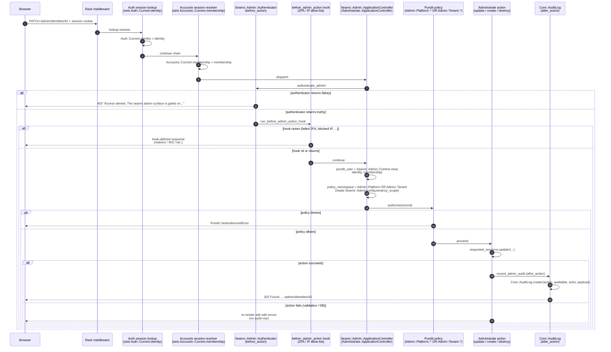
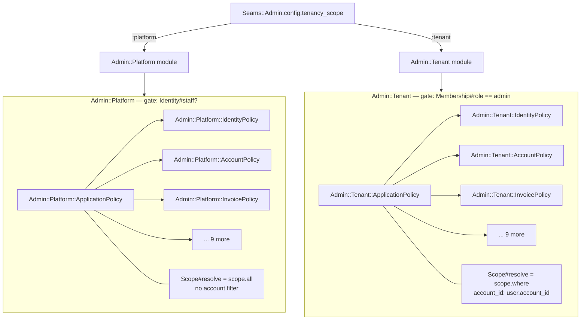

# Seams architecture — Wave 11A addendum (admin engine)

This document is an addendum to
[`ARCHITECTURE_WAVE_9.md`](ARCHITECTURE_WAVE_9.md) and
[`ARCHITECTURE_WAVE_10.md`](ARCHITECTURE_WAVE_10.md). Read those
first; they cover the engine inventory, the data model, the per-engine
`Current` namespaces, and the splice / eject machinery this wave
builds on.

Wave 11A introduces a single new engine — `admin` — and with it a
**new authorization pattern** (Pundit `policy_namespace` selecting at
request time between `Admin::Platform::*` and `Admin::Tenant::*`),
**a new audit integration** (the admin engine's `record_admin_audit`
after_action writing `Core::AuditLog` rows for every successful
write), and **a reinterpretation of the AdminUser-separation rule**
(Wave 9's credential-only Identity satisfies the rule's intent; a
boolean `staff?` flag is the right granularity). The framework
selection — Administrate over ActiveAdmin, Avo, Trestle, Motor, and
RailsAdmin — is recorded in
[`../proposals/admin_engine_administrate.md`](../proposals/admin_engine_administrate.md).

Wave 11A doesn't change any existing runtime shapes. The admin engine
is **opt-in**: a host that runs only the canonical six (core, auth,
accounts, notifications, billing, teams) sees no new behaviour until
they explicitly run `bin/rails generate seams:admin`.

---

## 1. The admin engine in one paragraph

The admin engine is read-only over the existing seams tables — it
ships **no migrations**. `bin/rails generate seams:admin` writes an
`engines/admin/` engine into the host that mounts at `/admin` and
ships twelve Administrate dashboards (Identity, Account, Membership ×
2, Team, TeamMembership, Invitation, Notification,
NotificationPreference, Plan, Subscription, Invoice, LifetimePass).
The engine's `ApplicationController` subclasses
`Administrate::ApplicationController`, includes a gate concern
(`Seams::Admin::Authenticator`), wires `Pundit::Authorization`,
exposes a `policy_namespace` that flips between platform and tenant
mode at request time, and writes a `Core::AuditLog` row after every
successful create/update/destroy.

---

## 2. Request flow

A single admin request — say, an operator clicking "Update" on an
Identity — traverses six checkpoints in order: cookie → session →
Identity gate → policy namespace selection → resource action → audit
log row.



The contract worth holding in your head:

- **Authentication is per-Identity, not per-AdminUser.** The default
  gate reads `current_identity&.staff?`. Hosts that need hard
  isolation override `Seams::Admin.config.authenticator`.
- **Authorization is per-namespace, switched at request time.**
  `policy_namespace` returns a `Module` (`Admin::Platform` or
  `Admin::Tenant`) — not an Array. Pundit looks up the policy under
  the returned namespace following the standard `Module::ResourcePolicy`
  convention.
- **`pundit_user` is a Struct, not the raw Identity.** The
  `Seams::Admin::Context` Struct wraps both Identity and Membership
  so tenant policies can read `account_id` without each policy
  reaching into the controller.
- **Audit-log writes are best-effort.** The after_action rescues
  `StandardError`, logs the failure, and returns. A failing audit
  write must not break the admin response — the operator's action
  already succeeded by the time the after_action runs.

---

## 3. The two-mode policy split

The two policy namespaces share the same surface — every
`*Policy < ApplicationPolicy` exposes
`{index,show,new,create,edit,update,destroy}?` predicates and a
`Scope` inner class — but their *meaning* differs.



Tenant mode requires the `accounts` engine (it reads
`Accounts::Current.membership` to derive `account_id`). Platform mode
runs without accounts as long as `Auth::Identity#staff?` is set.

A host that needs per-action overrides — say "support admins may read
Identity records but never destroy them" — ejects the relevant policy
file and overrides the predicate:

```bash
bin/seams resolve --eject admin/app/policies/admin/platform/identity_policy.rb
# Edit engines/admin/app/policies/admin/platform/identity_policy.rb:
# def destroy?; user.identity&.support? || user.identity&.staff?; end
```

Future `bin/seams admin` runs leave the ejected file alone (the
generator-wide `EjectAware` mixin reads the eject header from the
first 200 bytes of the destination).

---

## 4. The audit-log integration

The admin engine writes `Core::AuditLog` rows from a Rails
`after_action`, not from a model `after_save` callback. Two reasons:

1. **Resource is Administrate-resolved, not model-resolved.** The
   action might create a child record (`Accounts::Membership` for an
   "invite to account" flow) where the auditable is the resource
   Administrate routed to, not the model that triggered the
   `after_save`. `requested_resource` is the canonical
   Administrate-resolved record.
2. **Actor lookup is per-request.** Audit rows want the human driving
   the request (`Auth::Current.identity`), not the system actor a
   model `after_save` might see if the write happened from a
   background job. The after_action runs in the request thread; the
   lookup is reliable.

The integration deliberately does NOT rely on the
`Core::Auditable` model concern. Hosts that include `Core::Auditable`
on individual models still get audit rows from those models'
`after_save` callbacks — those are independent of the admin write
path. The admin after_action writes a *second* row with
`auditable_type` set to the Administrate resource and
`actor_id = Auth::Current.identity&.id` so the operator-driven
trail is visible distinct from any model-driven audit chain.

---

## 5. Why `staff?` on Identity, not a separate `AdminUser`?

This wave reinterprets — does **not** violate — the seams
"`User` and `AdminUser` must live on separate tables" rule.

The rule existed because in classic Rails apps `User` carries
customer-facing concerns (orders, billing, notifications, profile,
preferences) that you do not want admins to inherit. Two reasons that
mattered:

1. **Privilege escalation risk.** A customer User accidentally
   promoted to admin gets the union of customer + admin attack
   surfaces.
2. **Separate auth flows.** Admins typically want stricter
   authentication (2FA, SSO, IP allow-list, separate session timeout)
   than customers.

In seams Wave 9, `Auth::Identity` is **already** the credential-only
object — it has no customer concerns to inherit from. Customer-facing
data lives on `Accounts::Membership` (account-scoped) and the host's
own domain models. Result:

- **Privilege escalation risk** is moot — there's nothing dangerous to
  inherit. A boolean `staff?` flag adds admin permissions without
  pulling in customer state.
- **Separate auth flows** are still possible: hosts that want a
  hardened admin auth surface override
  `Seams::Admin.config.authenticator` with a callable that consults
  their separate auth (SSO + 2FA, IP allow-list + WebAuthn, etc.).
  Wave 11A ships the hook (`before_admin_action`); the auth surface
  itself is the host's responsibility.

The reinterpretation is documented in three places:

- The engine README (the
  [`Why staff? on Identity, not a separate AdminUser table?`](../lib/generators/seams/admin/templates/README.md.tt)
  section).
- The Wave 11A proposal
  ([`proposals/wave_11a_admin_engine.md`](../proposals/wave_11a_admin_engine.md)).
- The auto-memory entry
  (`feedback_user_vs_admin_separation.md`) was updated 2026-05-10 to
  reflect the context-dependent reading.

Future contributors who read the rule, then read this engine and find
no `AdminUser` table, can find the reasoning in any of three
locations without git-archaeology.

---

## 6. The five insertion-point markers

Wave 11A adds five markers, bringing the catalogue total to 38 across
seven engines:

| Marker | File | Purpose |
| --- | --- | --- |
| `admin.engine.events` | `engines/admin/lib/admin/engine.rb` | Register new admin events. Phase 1 ships none; Phase 3 adds `admin.action.taken.admin` when the audit-log auto-write fires. |
| `admin.routes.before_resources` | `engines/admin/config/routes.rb` | Routes that need precedence over the dashboard resources (impersonation entry points, bulk-action endpoints). |
| `admin.routes.after_resources` | `engines/admin/config/routes.rb` | New top-level admin routes (custom collection routes, JSON-only endpoints, status-page integrations). |
| `admin.configuration.attributes` | `engines/admin/lib/admin/configuration.rb` | New configuration knobs (`attr_accessor`). |
| `admin.configuration.defaults` | `engines/admin/lib/admin/configuration.rb` | Defaults for the new knobs (`@new_knob = sensible_default` inside `initialize`). |

Format spec lives in [`INSERTION_POINTS.md`](INSERTION_POINTS.md);
canonical list in
[`INSERTION_POINTS_CATALOGUE.md`](INSERTION_POINTS_CATALOGUE.md).

The first follow-up generator on the admin engine (likely
`seams:admin:add_dashboard <model>`) targets
`admin.routes.after_resources` to splice a new `resources` line and
`admin.engine.events` to register a new event.

---

## 7. Where Wave 11A sits in the wave sequence

Wave 9 was foundational (Identity / Account / Team rework). Wave 10
was multiplicative (insertion points + follow-up generators + eject
CLI). Wave 11A is **additive on top of both**: it consumes Wave 10's
splice machinery for its own markers and consumes Wave 9's
`Auth::Identity#staff?` + `Accounts::Current.membership` shapes
verbatim.

The next two waves continue to consume Wave 10 + Wave 11A machinery:

- **Wave 11B** (permissions DSL + outgoing webhooks) ships
  `seams:permissions:add_role` as a follow-up generator targeting a
  new permissions marker. The admin engine's per-policy ejection
  pattern is the model permissions DSL ejection follows.
- **Wave 12** (small-wins polish) places the deferred
  `core.configuration.attributes` marker once Configuration lands on
  core, and converts inline event registrations to a YAML registry —
  including the admin engine's `admin.engine.events` marker.

The shape of the admin engine doesn't change between waves — only the
follow-up generators that target its markers grow.

---

## See also

- [`../proposals/wave_11a_admin_engine.md`](../proposals/wave_11a_admin_engine.md) — five-phase orchestration and risks.
- [`../proposals/admin_engine_administrate.md`](../proposals/admin_engine_administrate.md) — framework selection rationale (the May 2026 research report).
- [`../lib/generators/seams/admin/admin_generator.rb`](../lib/generators/seams/admin/admin_generator.rb) — the `bin/rails generate seams:admin` implementation.
- [`../lib/generators/seams/admin/templates/README.md.tt`](../lib/generators/seams/admin/templates/README.md.tt) — the engine README a fresh host operator reads first.
- [`INSERTION_POINTS_CATALOGUE.md#admin-engine-wave-11a`](INSERTION_POINTS_CATALOGUE.md) — the five admin markers in the canonical catalogue.
- [`ARCHITECTURE_WAVE_10.md`](ARCHITECTURE_WAVE_10.md) — the splice + eject machinery the admin engine inherits.
- [`ARCHITECTURE_WAVE_9.md`](ARCHITECTURE_WAVE_9.md) — the Identity / Account / Team shapes the admin engine reads.
