# Seams architecture (post-Wave 9)

This document is the canonical reference for how the seams gem is put
together after Wave 9.
Wave 9 was the breaking rework of the identity / account / team
boundary; everything in this document reflects the post-Wave-9
shape. If you've never seen the codebase before, read this end-to-end
once and you should be able to navigate the rest of the repo by file
path. If you're the gem's author returning after a break, this is
your map back in.

For the breaking-change inventory and the upgrade procedure see
[`UPGRADING_FROM_WAVE_8.md`](UPGRADING_FROM_WAVE_8.md). For the
list of Wave 9 changes in chronological order, the [`CHANGELOG`](../CHANGELOG.md#wave-9--identity--account--team-rework-breaking).
For per-engine surface-area reference, [`ENGINE_CATALOGUE.md`](ENGINE_CATALOGUE.md).
For the cross-engine `Current` story, [`CURRENT_ATTRIBUTES.md`](CURRENT_ATTRIBUTES.md).

This document is structured top-down: what seams is, the engines
it ships, the data model that holds them together, and then the
flows (request, event, generator, webhook, notification) that
exercise them.

---

## 1. What seams is, and how it's consumed

Seams is a CLI framework for generating modular Rails engines. It
isn't a runtime gem in the usual sense: hosts depend on it for as
long as they're scaffolding code, and the generated engines (under
`engines/<name>/`) are owned outright by the host. The gem stays in
the Gemfile so the boundary cops keep working and so the host can
re-run a generator after upgrading, but no production code path
threads through `seams/lib`. The shape is "Bullet-Train-without-the-vendor-lock-in":
the substrate, not a starter kit.

The host pulls the gem in with a path source during development and
a normal version pin in production:

```ruby
# Gemfile
gem "seams", path: "../seams"   # contributor mode
gem "seams", "~> 0.9"            # consumer mode
```

After `bin/rails generate seams:install` the host has a
`bin/seams` wrapper, a CI workflow, the boundary cops, and an
`engines/` directory ready for canonical generators. From there
each `bin/seams <engine>` call produces a real Rails engine —
models, controllers, migrations, dummy app, specs, the lot.

```mermaid
flowchart LR
    Author[seams gem<br/>github.com/Davidslv/seams] -->|path: ../seams| HostGemfile[Host Gemfile]
    HostGemfile --> RailsGenerate[bin/rails generate seams:install]
    RailsGenerate --> InstallOut[bin/seams wrapper<br/>.github/workflows/ci.yml<br/>boundary cops<br/>config/initializers/seams.rb]
    InstallOut --> SeamsCLI[bin/seams &lt;cmd&gt;]
    SeamsCLI -->|exec bin/rails generate seams:engine| Generators[lib/generators/seams/]
    Generators -->|writes templates| EnginesDir["engines/{auth,accounts,teams,&hellip;}/"]
    EnginesDir -->|require| HostBoot[Host Rails app boot]
    HostBoot --> Runtime[Production runtime]
```

`bin/seams` is a thin Ruby wrapper around `bin/rails generate
seams:<name>` — see
[`lib/generators/seams/install/templates/bin_seams.tt`](../lib/generators/seams/install/templates/bin_seams.tt).
It exists so day-to-day commands stay short (`bin/seams auth` vs
`bin/rails generate seams:auth`) and so host docs can promise the
six-letter form across every generator. Three flavours of subcommand:

- **Canonical generators** (`install`, `core`, `auth`, `accounts`,
  `notifications`, `billing`, `teams`) shell out to
  `bin/rails generate seams:<name>`.
- **Generic** (`engine <name>`, `remove <name>`) shell out the same way.
- **Tasks** (`list`) shell out to `bin/rails seams:<name>`.

The path-source pattern matters for development ergonomics: edit
`/Users/davidslv/projects/seams/lib/generators/seams/auth/templates/app/models/identity.rb.tt`,
re-run `bin/seams auth --force` in any host that points at that
path, and the new template is in. No publish cycle. The seams-example
demo at `/Users/davidslv/projects/seams-example/` is exactly such a
host — it's the integration test for the gem.

---

## 2. The six canonical engines

Wave 9 split the old monolithic `Auth::User` into three peer
engines plus the existing supporting cast. The full engine list is
in [`ENGINE_CATALOGUE.md`](ENGINE_CATALOGUE.md); this section
focuses on how they relate.

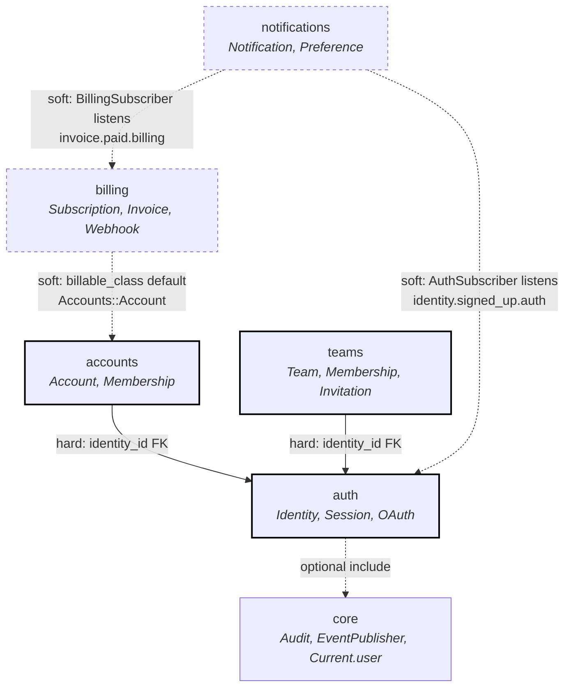

Two kinds of edge in this graph:

- **Hard dependency** (solid line): the engine raises a clear
  `[seams ...] missing required cross-engine dependency` error at
  boot if its peer isn't installed. Both `Accounts::Engine` and
  `Teams::Engine` enforce this against `Auth::Identity` — see
  [`lib/generators/seams/accounts/templates/lib/engine.rb.tt`](../lib/generators/seams/accounts/templates/lib/engine.rb.tt#L33)
  and [`lib/generators/seams/teams/templates/lib/engine.rb.tt`](../lib/generators/seams/teams/templates/lib/engine.rb.tt#L27).
  Wave 9 added these because the old failure mode — a NULL
  `identity_id` surprise on the first query — was painful to
  debug.
- **Soft dependency** (dashed line): the engine works without the
  peer but adds extra behaviour when the peer is around. Billing's
  `Billing::Engine` only includes `Billing::Billable` into the
  configured `billable_class` if that class is loadable
  ([`lib/engine.rb.tt`](../lib/generators/seams/billing/templates/lib/engine.rb.tt#L47)).
  Notifications attaches `BillingSubscriber` only when
  `Billing::Engine` is defined ([`notifications/templates/lib/engine.rb.tt`](../lib/generators/seams/notifications/templates/lib/engine.rb.tt#L28)).

Each engine occupies a deliberately narrow slice of responsibility.
The headlines:

- **core** — primitives (audit log, current attributes, soft delete,
  sluggable, tenant scope, event publisher with actor metadata). No
  controllers, no public routes. Every other engine can build on it.
- **auth** — credentials and sessions. Owns `Auth::Identity`, the
  human, and everything attached to that human's login: passwords,
  OAuth grants, passkeys, magic links, API tokens.
- **accounts** — the tenant boundary. Owns `Accounts::Account` and
  the `Accounts::Membership` join to identity. Replaced the
  Wave-8 conflation of "user owns credentials AND user owns
  workspace" with a clean three-engine split.
- **notifications** — STI Notification + Delivery + Preference;
  channel adapters (email, SMS, in-app); two cross-engine
  subscribers (Auth, Billing). Polymorphic `owner` so a
  Notification can belong to anything — an Identity (welcome
  email), an Account (paid-invoice receipt), or a host model.
- **billing** — Stripe integration via the official `stripe` gem,
  thirteen webhook handlers, lifetime-deal support. Bound to a
  configurable `billable_class` (default `Accounts::Account`).
- **teams** — optional collaborative grouping that joins
  `Auth::Identity` directly. Peer to Accounts, not nested.

The auth engine's directory tree is representative of every canonical
engine — a real Rails engine with `app/`, `config/`, `db/migrate/`,
`lib/`, and a per-engine `spec/dummy/` host:

```mermaid
flowchart TD
    Root["engines/auth/"]
    Root --> App["app/"]
    Root --> Lib["lib/"]
    Root --> Db["db/migrate/"]
    Root --> Config["config/routes.rb"]
    Root --> Spec["spec/"]

    App --> AppModels["app/models/auth/<br/>identity.rb<br/>session.rb<br/>api_token.rb<br/>current.rb<br/>oauth/provider.rb"]
    App --> AppCtrl["app/controllers/auth/<br/>sessions_controller.rb<br/>registrations_controller.rb<br/>password_resets_controller.rb<br/>oauth/callbacks_controller.rb"]
    App --> AppSvc["app/services/auth/<br/>register_identity.rb<br/>authenticate_identity.rb<br/>reset_password.rb"]
    App --> AppMail["app/mailers/auth/<br/>passwords_mailer.rb"]
    App --> AppViews["app/views/auth/<br/>sessions/registrations/password_resets/"]

    Lib --> LibConcern["lib/auth/concerns/<br/>authentication.rb<br/>authenticatable.rb<br/>api_authenticatable.rb"]
    Lib --> LibOauth["lib/auth/oauth/<br/>abstract.rb google.rb github.rb"]
    Lib --> LibEngine["lib/auth/engine.rb<br/>configuration.rb"]

    Db --> Mig["create_auth_identities.rb<br/>create_auth_sessions.rb<br/>create_auth_oauth_providers.rb<br/>create_auth_api_tokens.rb"]

    Spec --> SpecDummy["spec/dummy/<br/>(per-engine Rails app)"]
    Spec --> SpecRuntime["spec/runtime/<br/>auth_boot_spec.rb<br/>auth_login_flow_spec.rb"]
    Spec --> SpecModel["spec/models/auth/"]
```

Two structural choices worth flagging. First, controllers and
models live under the engine namespace (`app/models/auth/identity.rb`
defines `Auth::Identity`) — `isolate_namespace Auth` in
[`engine.rb.tt`](../lib/generators/seams/auth/templates/lib/engine.rb.tt#L4)
keeps the engine routable at `/auth` without polluting the host's
namespace. Second, `lib/auth/concerns/` is the engine's public
surface: the cop allowlist tags `Auth::Authentication` and
`Auth::Authenticatable` as `ExposedConcerns` so other code can
`include` them. Models (`app/models/auth/identity.rb`) deliberately
stay private to the engine.

---

## 3. Identity, Account, and Membership — the heart of Wave 9

Wave 9 collapsed the old `Auth::User` (which owned password digest
AND tenant-membership concepts) into three peer rows. The result is
the four-table shape every other engine builds on.

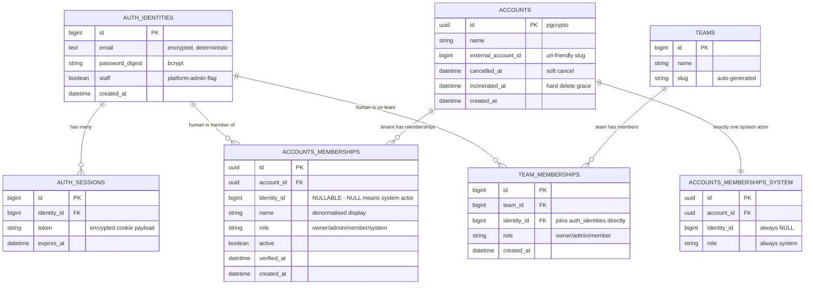

Three properties of this shape are load-bearing.

**One Identity, many memberships.** A human (one row in
`auth_identities`) can be `owner` of Account A and `member` of
Account B simultaneously. The compound unique index
`(account_id, identity_id)` on `accounts_memberships` enforces
"at most one membership per (account, identity) pair", and the role
travels on the membership row, not on the Identity. See the
migration in
[`db/migrate/create_accounts_memberships.rb.tt`](../lib/generators/seams/accounts/templates/db/migrate/create_accounts_memberships.rb.tt#L36).
This is what enables the multi-tenant SaaS shapes Wave 9 was built
for (B2C, B2B-flat, B2B-with-teams).

**Team is a peer of Account, not nested.** `team_memberships`
joins `Auth::Identity` directly to `Teams::Team`; there is no
`account_id` on `teams` by default. Hosts that want "Team belongs
to Account" wire it themselves with a host-side migration. The
rationale: most B2B-flat SaaS apps use Accounts but not Teams; most
team-as-tenant apps use Teams but not Accounts; and the few that
need both want the wiring on their terms. See
[`teams/templates/app/models/membership.rb.tt`](../lib/generators/seams/teams/templates/app/models/membership.rb.tt)
and the Wave-9 design note in [`UPGRADING_FROM_WAVE_8.md`](UPGRADING_FROM_WAVE_8.md#removed-teamsteamable).

**System actor is a Membership with `identity_id IS NULL`.** Audit
logs and event payloads need a valid actor reference even when no
human triggered the change (background jobs, webhook ingestion,
scheduled sweepers). Rather than special-casing every audit write,
each Account auto-creates one Membership with `role: "system"` and
`identity_id: nil`. The partial unique index
`(account_id) WHERE role = 'system'` enforces "exactly one system
actor per Account" at the DB level — Wave 9 caught that the
existing `(account_id, identity_id)` compound index couldn't
prevent two `(account_id, NULL)` rows because Postgres treats
NULLs as distinct in unique indexes. The fix is in
[`db/migrate/create_accounts_memberships.rb.tt`](../lib/generators/seams/accounts/templates/db/migrate/create_accounts_memberships.rb.tt#L45).

The transactional creation path that wires this together is
`Accounts::Account.create_with_owner` — every demo row, every
seams-example seed, and every test that spins up a tenant goes
through it:

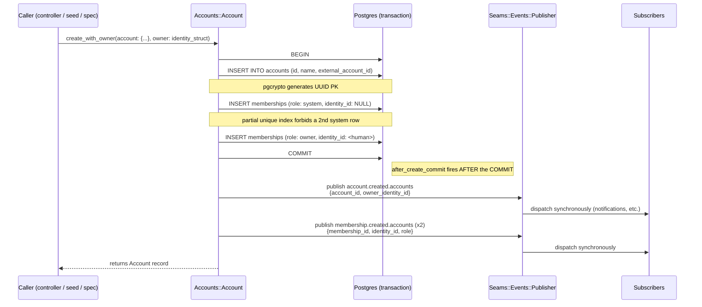

The transaction boundary is deliberate. If any of the three INSERTs
fails, all three roll back — there's no half-built Account with a
system actor but no owner, or vice versa. Events fire
`after_create_commit`, *outside* the transaction, so a slow
subscriber doesn't hold the AccountsMemberships table lock and a
raising subscriber doesn't roll back the persisted rows.
[`accounts/templates/app/models/account.rb.tt`](../lib/generators/seams/accounts/templates/app/models/account.rb.tt#L69)
is the canonical implementation; the seams-example
[`db/seeds.rb`](https://github.com/Davidslv/seams-example) walks the same
path.

---

## 4. The per-request `Current` namespace pattern

Wave 9's other big architectural change is that every engine ships
its own `ActiveSupport::CurrentAttributes` namespace. There is no
single top-level `::Current`; instead `Auth::Current.identity`,
`Accounts::Current.account`, `Accounts::Current.membership`,
`Teams::Current.team`, and `Core::Current.user` each live inside
the engine that owns the concept. Reads are intentionally
cross-engine; writes are not.

A typical signed-in request flows through the cascade like this:

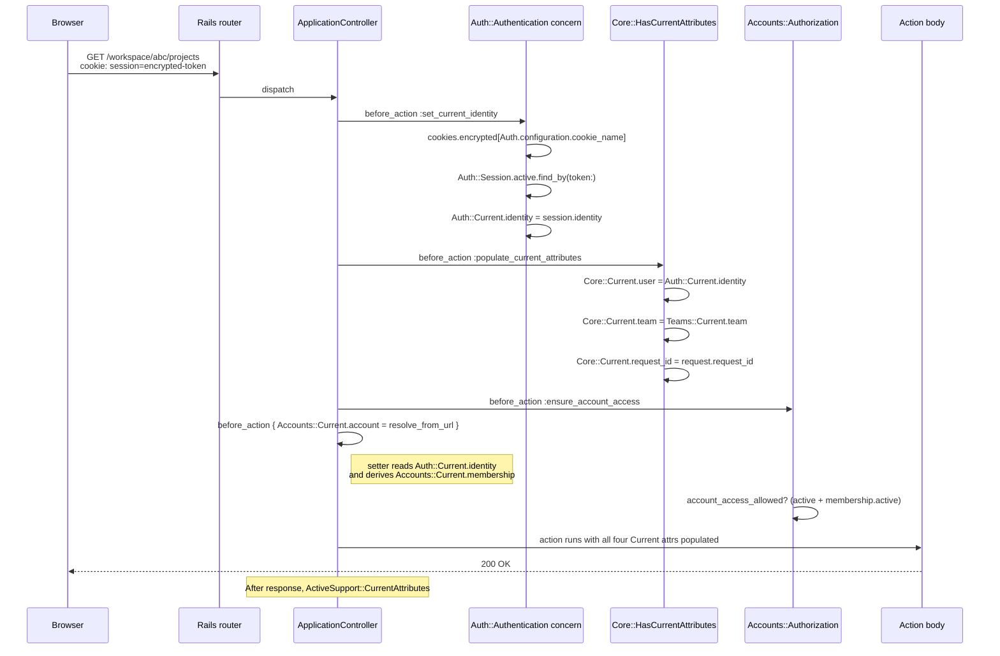

Three details worth grounding in the code.

**Order matters.** `Accounts::Current.account=` reads
`Auth::Current.identity` to derive the matching Membership — see
[`accounts/templates/app/models/current.rb.tt`](../lib/generators/seams/accounts/templates/app/models/current.rb.tt#L22).
If you set Account before Identity, `Accounts::Current.membership`
silently stays `nil` and every authorisation check fails closed.
The canonical wiring order documented in
[`CURRENT_ATTRIBUTES.md`](CURRENT_ATTRIBUTES.md#cascade-order) is
`Auth::Authentication` → `Core::HasCurrentAttributes` →
`Accounts::Authorization`, and the order is enforced socially by
the host's `ApplicationController` — Wave 9 documented it because
mis-ordering was the cause of three of the eight Phase 6a fixes in
the [CHANGELOG](../CHANGELOG.md#fixed).

**Cross-engine reads are intentional, writes are not.** The
`Seams/NoCrossEngineModelAccess` cop normally flags any reference
to another engine's data classes as a boundary violation. `Current`
is the documented exception: every engine's `Current` is the
shared per-request bus, and forbidding cross-engine reads of it
would force every cross-engine identity / account / team lookup to
go through a host-defined shim. The cop's `DEFAULT_IGNORED_LEAF_NAMES`
list in
[`lib/seams/cops/no_cross_engine_model_access.rb`](../lib/seams/cops/no_cross_engine_model_access.rb#L37)
includes `Current` for exactly that reason.

**Each engine owns its own namespace.** A host that doesn't install
accounts shouldn't see `Accounts::Current.account` floating around
as if it were a framework-level concept. Putting the namespace
inside the engine makes `bin/rails generate seams:remove accounts`
cleanly take the namespace away with the engine. The namespaces
discoverable via `grep '::Current' engines/<engine>/`, never via
top-level Rails config.

---

## 5. The event bus

Engines never call into each other's models. They publish events
and subscribe to events. The bus is `Seams::Events::Publisher`,
which wraps `ActiveSupport::Notifications` with three additions
seams cares about: a name-format check, the
`Seams::EventRegistry` to prevent two engines from claiming the
same name, and the reload-safe `attach_class` shape for
subscribers.

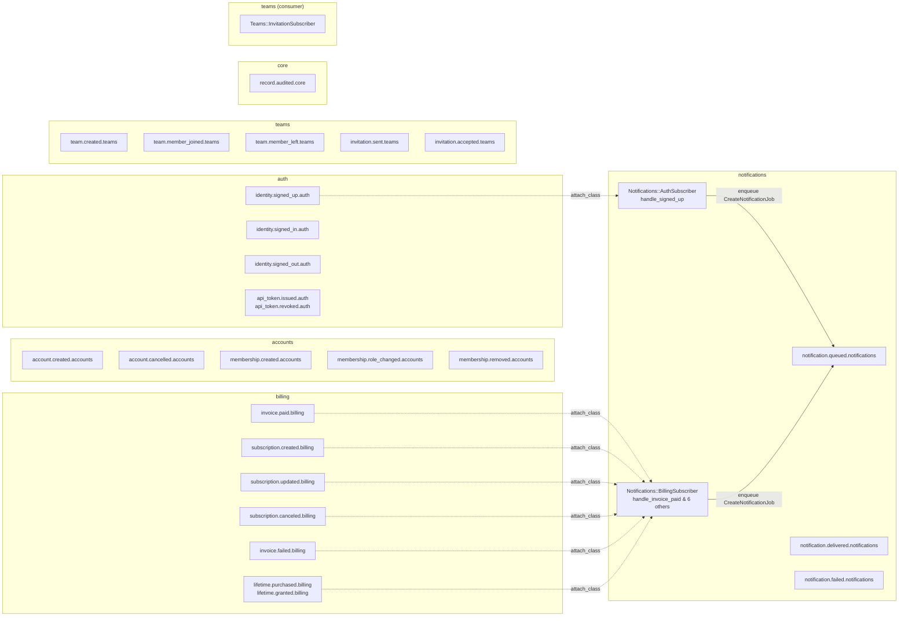

Solid arrows are publication paths; dashed arrows are subscription
attachments registered at engine boot. Every event name follows the
`<subject>.<action>.<engine>` shape — the trailing engine token is
how `Seams::Events::Publisher.orphan_subscriptions` identifies a
typo (e.g. `identity.signed_up.atuh` is unregistered, so the
subscription has no emitter).

The publisher API has two attach modes worth knowing:

- **`attach_once(key, event_name, &block)`** — legacy. Registers a
  block that closes over the subscriber class as it existed when
  `attach_once` first ran. Survives idempotent re-runs across
  threads, but Rails autoreload recreates the subscriber class
  object on every reload and the block keeps calling the *old*
  one — edits to the subscriber's methods are invisible until a
  full server restart. See
  [`lib/seams/events/publisher.rb#L72`](../lib/seams/events/publisher.rb#L72).
- **`attach_class(key, event_name, class_name:, method_name:)`** —
  the reload-safe form. Stores the subscriber class as a STRING
  name and re-resolves `Object.const_get(class_name)` on every
  dispatch. A Rails autoreload swaps the constant for a freshly-loaded
  class object and the next event reaches the new code without a
  restart. This is what every Wave-9 subscriber uses
  (`Notifications::AuthSubscriber.attach!`,
  `Notifications::BillingSubscriber.attach!`,
  `Teams::InvitationSubscriber.attach!`). See
  [`lib/seams/events/publisher.rb#L101`](../lib/seams/events/publisher.rb#L101).

The `EventRegistry` is the source of truth for "what events does
this app emit". Each engine's `register_events` initializer adds
its names; `Publisher.publish` consults the registry and raises
`UnregisteredEventError` if the caller publishes an event no engine
declared. The orphan-subscription check
([`bin/audit`](../bin/audit) runs it pre-push) walks every
subscription and lists names that no engine has registered as
emitted — catches typos before they ship.

Subscribers run **synchronously in the publisher's thread**.
`ActiveSupport::Notifications` has no async mode by default, so
every subscriber should treat its handler as "enqueue a background
job and return". The notifications subscribers do exactly this —
`AuthSubscriber#handle_signed_up` enqueues
`CreateNotificationJob.perform_later`, never the DB write inline.
The convention is documented in the publisher's docstring (lines
14-20).

---

## 6. Generator pipeline

A `bin/rails generate seams:auth` invocation walks through six
distinct phases. Knowing the order matters when adding a generator,
because each phase has its own conventions.

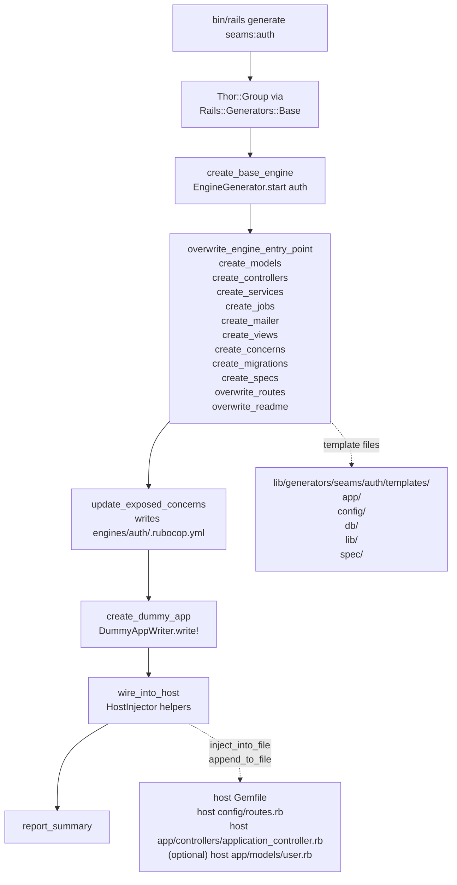

The phases at a glance:

1. **Base scaffold.** Every canonical generator starts by running
   `EngineGenerator` to lay down the generic engine skeleton —
   `Gemfile`, gemspec, `Rakefile`, `lib/<name>.rb`, `lib/<name>/version.rb`,
   `.rubocop.yml`, `engines/<name>/spec/<name>_spec.rb`. This step
   is shared so every engine ships the same structure.
2. **Template overwrite.** The canonical generator overwrites the
   files it cares about (engine.rb, routes.rb, every model and
   controller, the migrations, the specs). `force: true` on each
   `template` call means a re-run picks up gem-side template
   changes — the trade-off Wave 10 will address with insertion-point
   markers and `bin/seams resolve --eject` (see the
   roadmap).
3. **Cop config.** `update_exposed_concerns` edits the engine's
   own `.rubocop.yml` to allowlist concerns the engine intentionally
   exposes (e.g. Auth allows `Auth::Authenticatable` and
   `Auth::Authentication`) — see
   [`auth_generator.rb#L180`](../lib/generators/seams/auth/auth_generator.rb#L180).
4. **Dummy app.** `Seams::Generators::DummyAppWriter.write!` lays
   down a slim `spec/dummy/` Rails app inside the engine so the
   engine's specs can boot Rails and run against a real Postgres
   database without the host. Boilerplate (boot.rb, application.rb,
   environment.rb, database.yml, secret_key.rb, ApplicationRecord,
   ApplicationController, ApplicationMailer, schema.rb) comes from
   the writer; the engine supplies the schema body. See
   [`lib/seams/generators/dummy_app_writer.rb`](../lib/seams/generators/dummy_app_writer.rb).
5. **Host wiring.** `HostInjector` mixes idempotent edits into the
   host: `host_inject_gem`, `host_inject_mount`,
   `host_inject_include_in_user`,
   `host_inject_include_in_application_controller`. Each method
   skips if the snippet is already present, and each prints a
   yellow `skip` line if the target file is missing. The user-model
   helper is a best-effort no-op post-Wave-9 because the canonical
   demo doesn't ship `app/models/user.rb`. See
   [`lib/seams/generators/host_injector.rb`](../lib/seams/generators/host_injector.rb).
6. **Post-install message.** `report_summary` prints "next steps" —
   `bundle install`, `bin/rails db:migrate`, run the engine specs.
   These are the only intentionally human-readable bits of generator
   output; everything else is Thor's `create`/`overwrite` log.

Two corollaries fall out of this pipeline. Generators are **safe to
re-run** — `force: true` reapplies templates without prompting.
And generators are **independently maintainable** — each engine's
generator is a single file under `lib/generators/seams/<name>/<name>_generator.rb`,
and adding an engine means adding one directory plus an entry in
[`bin/seams`](../lib/generators/seams/install/templates/bin_seams.tt#L16).

---

## 7. Authentication flow

Two end-to-end flows are worth tracing because they touch multiple
engines: registration (which triggers the welcome email cascade)
and password reset (which uses Rails 8's built-in signed-id token
machinery rather than a column).

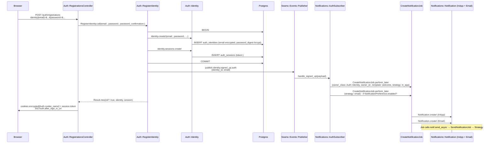

The transactional shape matters. The `Auth::Identity` row, the
encrypted email, the bcrypt password digest, and the initial
`Auth::Session` row are all created inside one DB transaction in
[`register_identity.rb.tt`](../lib/generators/seams/auth/templates/app/services/register_identity.rb.tt#L31).
The event fires *after* the transaction commits, so a subscriber
that queues a job can rely on the rows being readable from the job
worker. The job pattern is the firewall — `AuthSubscriber` never
inserts a `Notification` row inline; that would block the publisher
thread on a network-bound mailer call.

Password reset uses Rails 8's `has_secure_password reset_token`
machinery, which is a signed_id with a built-in 15-minute expiry —
no `password_reset_token` column, no `password_reset_token_sent_at`
column, no sweep job:

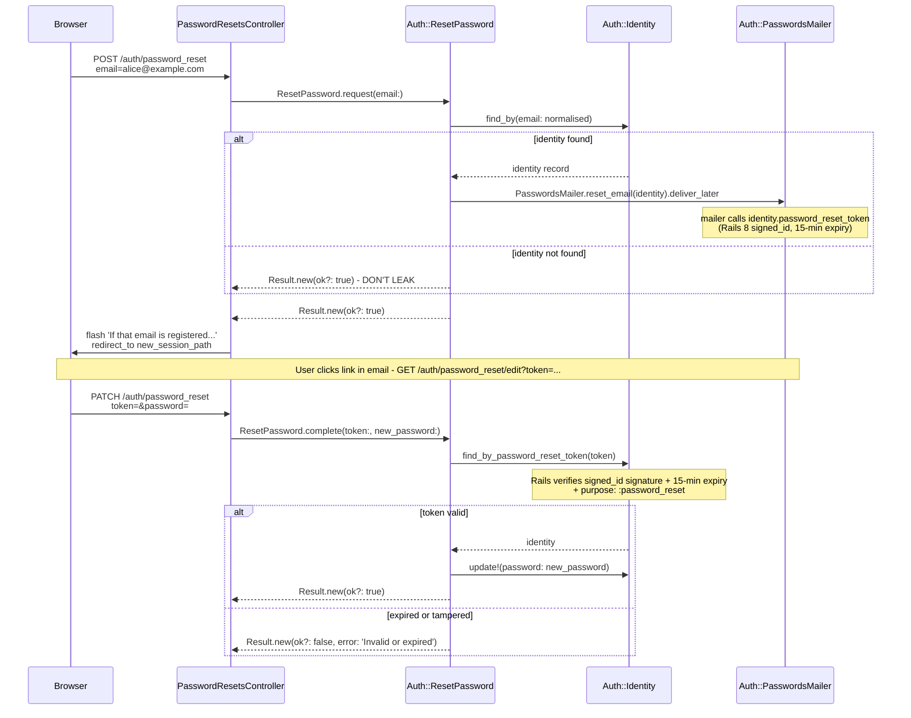

Wave 9 dropped the `password_reset_token` *column* and the
`reset_token: false` workaround that Wave 8 needed because
`Auth::User` (the old constant) clashed with the Rails-8
column. Renaming to `Auth::Identity` on its own table resolved the
clash; the column went away with it, and the reset flow now leans
on `has_secure_password`'s built-in signed-id helpers
(`#password_reset_token` and `Identity.find_by_password_reset_token`).
See
[`reset_password.rb.tt`](../lib/generators/seams/auth/templates/app/services/reset_password.rb.tt)
and the ROADMAP item describing the rationale (Wave 9 scope, line
33).

The "don't leak which emails are registered" pattern is in
[`password_resets_controller.rb.tt`](../lib/generators/seams/auth/templates/app/controllers/password_resets_controller.rb.tt#L19) —
the controller returns the same flash message whether the email was
known or not, and `Auth::Identity.authenticate` does a dummy bcrypt
hash on email-misses so the timing is constant
([`identity.rb.tt#L49`](../lib/generators/seams/auth/templates/app/models/identity.rb.tt#L49)).

---

## 8. Billing webhook flow

Stripe webhooks are the largest cross-engine flow in seams. A POST
hits the billing engine, the signature is verified, the event is
recorded for idempotency, one of thirteen handlers runs, the local
mirror table is upserted, the canonical seams event is published,
and the notifications engine's BillingSubscriber turns it into a
Notification owned by the Account.

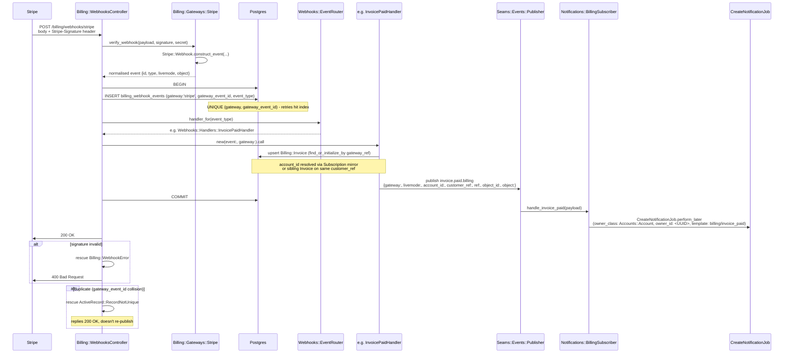

Three properties of this flow are load-bearing.

**Idempotency at the DB level.** Stripe will re-deliver an event for
days if your endpoint ever returns non-2xx. The unique index on
`billing_webhook_events (gateway, gateway_event_id)` means the
second delivery raises `ActiveRecord::RecordNotUnique` inside the
transaction, the controller catches it, and returns 200 without
re-publishing. Without the unique index a transient handler bug
would publish the same canonical event twice and the notifications
subscriber would create two welcome rows. See
[`webhooks_controller.rb.tt#L56`](../lib/generators/seams/billing/templates/app/controllers/webhooks_controller.rb.tt#L56).

**The notification owner is the Account, not the human.** Wave 9
flipped the `Billing.configuration.billable_class` default from
`"User"` to `"Accounts::Account"`. Subscriptions and invoices
belong to the *tenant* — multiple humans on one Account share one
billing relationship. The `BillingSubscriber.enqueue` method reads
`Billing.configuration.billable_class` to find the right
`owner_class_name` and looks up the row by the `account_id` that
every Wave-9 billing payload carries. See
[`billing_subscriber.rb.tt#L99`](../lib/generators/seams/notifications/templates/app/subscribers/billing_subscriber.rb.tt#L99).

**The polymorphic `owner_id` column is a string.** Wave 9 caught
that `notifications.owner_id` was bigint, which silently coerced
UUIDs to 0 — every billing notification was being attached to "the
Account whose UUID happened to coerce to 0", which is no
account. The migration in
[`create_notifications.rb.tt#L22`](../lib/generators/seams/notifications/templates/db/migrate/create_notifications.rb.tt#L22)
declares `owner_id` as `string`, so the column accommodates both
bigint Identity IDs and UUID Account IDs. Active Record's
polymorphic association casts the parameter to text in the prepared
statement; the lookup uses
`WHERE owner_type = ? AND owner_id = ?` and works the same way for
either PK type.

---

## 9. Notification delivery

The notifications engine carries the most internal machinery of any
engine — STI strategies, polymorphic owner, scheduling via
`ice_cube`, per-channel preferences, an in-app bell over ActionCable,
and email/SMS adapter ports. The end-to-end shape of a single
`identity.notify(strategy:, template:)` call:

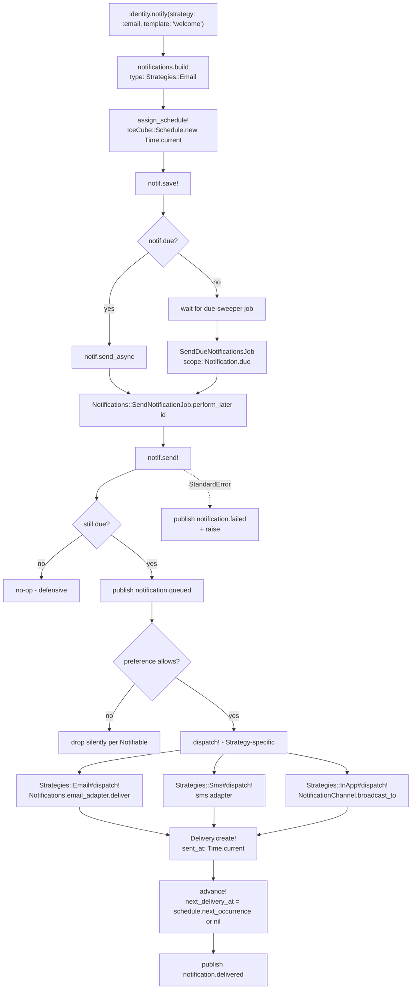

Per-channel preferences are keyed on `identity_id`, not on the
polymorphic Notification owner. The rationale: a single human
should be able to opt out of all email notifications across every
Account they belong to, regardless of which Account a given
Notification is addressed to. The `Notifications::NotificationPreference#enabled?`
class method ([`notification_preference.rb.tt#L23`](../lib/generators/seams/notifications/templates/app/models/notification_preference.rb.tt#L23))
takes `identity_id`, `channel`, and an optional `notification_type`,
falls back to a row with `notification_type: nil` if the type-specific
row is absent, and returns `true` (enabled) when no row exists at all
— "absent means use defaults".

The polymorphic `owner` on `Notification` ([`notification.rb.tt#L18`](../lib/generators/seams/notifications/templates/app/models/notification.rb.tt#L18))
means any model can own a notification: an Identity (welcome
email), an Account (paid-invoice receipt), a host model (a custom
"project archived" template). The `Notifications::Notifiable`
concern is optional sugar for the receiving side — it adds a
`notifications` `has_many` and a `#notify(strategy:, template:)`
helper. Hosts that include the concern on their own User model
override `notification_preference_identity_id` to point preference
lookups at the right Identity ID
([`notifiable.rb.tt#L99`](../lib/generators/seams/notifications/templates/lib/concerns/notifiable.rb.tt#L99)).

---

## 10. Boundaries and the rubocop cop

Engines should not reach into each other's data layers. The
`Seams/NoCrossEngineModelAccess` cop enforces this at lint time. It
takes one engine's perspective at a time (configured via
`OwnEngine` and `OtherEngines` in the engine's `.rubocop.yml`) and
flags any reference to a constant whose top segment is a sibling
engine, *unless* the reference falls into one of three exemptions.

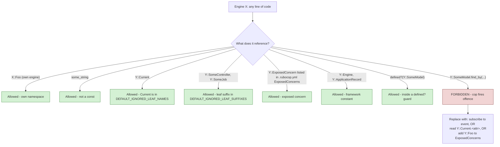

The cop's source is
[`lib/seams/cops/no_cross_engine_model_access.rb`](../lib/seams/cops/no_cross_engine_model_access.rb).
The exemption list (`DEFAULT_IGNORED_LEAF_NAMES`) is on line 37; the
suffix list (`DEFAULT_IGNORED_LEAF_SUFFIXES` — `Controller`, `Job`,
`Mailer`, `Helper`, `Component`, `Channel`, `Engine`) on line 50.
`Current` was added to `DEFAULT_IGNORED_LEAF_NAMES` in Wave 9
Phase 6a as part of the Phase 6a fix work (see CHANGELOG's
"Fixed" section).

The application-layer-integrity model. There are no DB-level FKs
across engines. `accounts_memberships.identity_id` references
`auth_identities.id` semantically but has no FK constraint — see
the migration comment at
[`create_accounts_memberships.rb.tt#L20`](../lib/generators/seams/accounts/templates/db/migrate/create_accounts_memberships.rb.tt#L20).
The rationale is that engines might end up in different Postgres
schemas or even different databases in production (a future "split
the auth engine onto its own DB" refactor shouldn't require
rewriting every cross-engine reference). Integrity is enforced at
the Ruby layer: the engine's `after_initialize` raises if the peer
isn't installed, and the cop catches the same constant being
referenced from the wrong side.

---

## 11. Test architecture

Seams' tests are in three tiers, each with a different cost-vs-confidence
trade-off.

```mermaid
flowchart TD
    subgraph Tier1["Tier 1: Per-engine unit specs (~1-2s each)"]
        UnitSpecs["spec/models/&lt;engine&gt;/&hellip;<br/>spec/runtime/&lt;engine&gt;_boot_spec.rb<br/>spec/mailers/&lt;engine&gt;/&hellip;"]
        Dummy["spec/dummy/<br/>(per-engine slim Rails app)"]
        UnitSpecs -->|boots| Dummy
        Dummy -->|connects| Postgres1[(Postgres test DB<br/>per engine)]
    end

    subgraph Tier2["Tier 2: Generator specs (~10s)"]
        GenSpecs["spec/generators/seams/&lt;name&gt;_generator_spec.rb"]
        TmpDir["spec/tmp/host_*<br/>(generated by spec)"]
        GenSpecs -->|"runs generator + asserts files"| TmpDir
    end

    subgraph Tier3["Tier 3: Integration full (~5-10 min)"]
        FullSpec["spec/integration_full/rails_new_spec.rb"]
        RailsNew[shells out to rails new tmp/host]
        AllGens[runs every canonical generator in order]
        AllSpecs[runs every engine's spec/runtime/]
        FullSpec --> RailsNew
        RailsNew --> AllGens
        AllGens --> AllSpecs
        AllSpecs --> Postgres2[(seams_integration_dev<br/>seams_integration_test)]
    end

    Audit["bin/audit"] --> Tier1
    Audit --> Tier2
    Audit --> Rubocop[rubocop --parallel]
    Audit --> BundleAudit[bundle-audit check --update]
    Audit --> Brakeman[brakeman --force]
    Audit --> Orphans[Publisher.orphan_subscriptions]
    Audit -->|"unless --fast"| Tier3
```

**Per-engine unit specs** boot a per-engine `spec/dummy/` Rails
app, connect to a per-engine Postgres database
(`<engine>_dummy_test`), load the engine's schema, and run model /
controller / mailer specs. The dummy app is itself written by
`Seams::Generators::DummyAppWriter` ([`lib/seams/generators/dummy_app_writer.rb`](../lib/seams/generators/dummy_app_writer.rb))
during `seams:<engine>` generation, so an engine's `spec/dummy/`
mirrors what its host would look like at minimum. Each engine's
schema is the canonical migration set translated into a single
`schema.rb`. Per-engine DB names mean parallel test runs don't
clobber each other.

**Generator specs** (`spec/generators/seams/`) run each generator
into a temp directory, then assert on the resulting file tree:
"did the migration get written?", "is `Auth::Authenticatable` in
the engine's `.rubocop.yml` ExposedConcerns?", "does the boot spec
file exist?". These are template-correctness probes — they catch
missing methods, wrong constants, missing requires — but they
don't actually boot the engine.

**`spec/integration_full/rails_new_spec.rb`** is the smoke probe
that boots a real `rails new` host and runs every canonical
generator end-to-end on Postgres. It takes ~5-10 minutes and is
excluded from the default `bundle exec rspec` run; `bin/audit` runs
it last unless `--fast` is passed. This is the only spec in the
repo that proves the generated engines actually boot in a real
Rails application — see
[`spec/integration_full/README.md`](../spec/integration_full/README.md).

`bin/audit` ([`bin/audit`](../bin/audit)) is the single pre-push
verification command. It chains: rubocop → rspec (default suite) →
bundle-audit → brakeman → publisher orphan-subscriptions →
integration_full. Pre-push git hook calls it; CI runs the same
checks via parallel jobs.

---

## 12. The seams-example demo

[`seams-example/`](https://github.com/Davidslv/seams-example) is
the canonical post-Wave-9 host. It's a regular Rails app with
`engines/{auth, accounts, billing, core, notifications, teams}/`
and the host wired into all six. Wave 9 regenerated the demo from
scratch (Phase 3b — see the [`CHANGELOG`](../CHANGELOG.md#wave-9--identity--account--team-rework-breaking))
so it reflects the Identity / Account / Team shape end-to-end.

The shortest tour is `db/seeds.rb`. Running `bin/rails db:seed`
once will produce a working multi-tenant demo:

```ruby
# 1. Create the human + their credentials
identity = Auth::Identity.find_or_create_by!(email: "demo+seams@example.com") do |i|
  i.password = "verysecret-demo-password"
end

# 2. Create the tenant + bootstrap memberships in one transaction
account = Accounts::Account.create_with_owner(
  account: { name: "Seams Demo Workspace" },
  owner:   OwnerStruct.new(identity, "Demo Owner")
)
# At this point the Account has:
#  - 1 Membership(role: "system", identity_id: nil) for audit-log writes
#  - 1 Membership(role: "owner",  identity_id: identity.id)
# And `account.created.accounts` + `membership.created.accounts` (x2)
# have fired through Seams::Events::Publisher.

# 3. Publish a custom event - any subscriber registered for
# user.onboarded.example will pick it up
Seams::Events::Publisher.publish(
  "user.onboarded.example",
  identity_id: identity.id, account_id: account.id, ...
)

# 4. Create an in-app notification owned by the Identity
Notifications::TypeRegistry.register("default", template: "default", channels: %i[in_app])
notification = identity.notify(strategy: :in_app, template: "default")

# 5. Create a Plan + Subscription on the Account
plan = Billing::Plan.find_or_create_by!(gateway_ref: "price_demo_seams") do |p|
  p.name = "Demo Plan"; p.amount_cents = 2900; p.currency = "GBP"; p.interval = "month"
end
Billing::Subscription.create!(
  gateway_ref: "sub_demo_seams_...", account_id: account.id,
  customer_ref: "cus_demo_seams", plan_ref: plan.gateway_ref, status: "active",
  current_period_end: 30.days.from_now
)

# 6. Create a Team + an owner Membership + a pending Invitation
team = Teams::Team.find_or_create_by!(slug: "seams-demo-team") { |t| t.name = "Seams Demo Team" }
Teams::Membership.create!(team_id: team.id, identity_id: identity.id, role: "owner")
Teams::Invitation.create!(team_id: team.id, email: "invitee+seams@example.com", role: "member")
```

Six lines per row create the canonical multi-tenant SaaS surface:
human + tenant + audit actor + welcome notification + paid-plan
subscription + collaborative team + outstanding invite. The full
seed is at
[`seams-example/db/seeds.rb`](https://github.com/Davidslv/seams-example).
After `db:seed`, `bin/rails console` is enough to poke at every
engine: `Auth::Identity.first`, `Accounts::Account.first.system_membership`,
`Teams::Team.first.memberships`, etc.

---

## 13. Closing — where Wave 10 picks up

Wave 9 was foundational. With the Identity / Account / Team shape
locked in, the next wave can stop regenerating engines and start
extending them. From the roadmap:

- **Wave 10** (now shipped — see
  [`ARCHITECTURE_WAVE_10.md`](ARCHITECTURE_WAVE_10.md) for the
  addendum) — splicing tooling: annotated insertion-point markers
  (33 across the six canonical engines), follow-up generators
  (`bin/rails generate seams:auth:add_oauth_provider linkedin` is
  the first showcase), and `bin/seams resolve` for ejection /
  marker listing / ejected-file survey.
- **Wave 11** — permissions DSL + outgoing webhooks: both ride on
  Wave 9's Account / Identity model and Wave 10's splicing tooling.
- **Wave 12** — small-wins polish across every engine
  (`run_load_hooks`, capability-flag concern inclusion, opinionated
  initializer templates, `<Resource>::Base` skeletal models, YAML
  event registries).
- **Wave 13** — `bin/seams upgrade` as a reusable GitHub Action
  plus a gem-vs-local-checkout swap.
- **Wave 14** — OpenAPI auto-gen.

Where to find each piece of Wave 9 functionality, by claim:

| Claim                                    | File path |
| ---                                      | ---       |
| Identity / Session / API token shape     | [`lib/generators/seams/auth/templates/app/models/`](../lib/generators/seams/auth/templates/app/models/) |
| Account.create_with_owner transaction    | [`lib/generators/seams/accounts/templates/app/models/account.rb.tt#L69`](../lib/generators/seams/accounts/templates/app/models/account.rb.tt#L69) |
| One system actor per Account (DB)        | [`lib/generators/seams/accounts/templates/db/migrate/create_accounts_memberships.rb.tt#L45`](../lib/generators/seams/accounts/templates/db/migrate/create_accounts_memberships.rb.tt#L45) |
| `Accounts::Current.account=` cascade     | [`lib/generators/seams/accounts/templates/app/models/current.rb.tt#L22`](../lib/generators/seams/accounts/templates/app/models/current.rb.tt#L22) |
| `Auth::Current` perimeter                | [`lib/generators/seams/auth/templates/lib/concerns/authentication.rb.tt#L52`](../lib/generators/seams/auth/templates/lib/concerns/authentication.rb.tt#L52) |
| Reload-safe subscriber attach             | [`lib/seams/events/publisher.rb#L101`](../lib/seams/events/publisher.rb#L101) |
| Boundary cop's `Current` exemption        | [`lib/seams/cops/no_cross_engine_model_access.rb#L37`](../lib/seams/cops/no_cross_engine_model_access.rb#L37) |
| AccountScoped fail-closed default        | [`lib/generators/seams/accounts/templates/lib/concerns/account_scoped.rb.tt#L67`](../lib/generators/seams/accounts/templates/lib/concerns/account_scoped.rb.tt#L67) |
| Notifications.owner_id is string         | [`lib/generators/seams/notifications/templates/db/migrate/create_notifications.rb.tt#L22`](../lib/generators/seams/notifications/templates/db/migrate/create_notifications.rb.tt#L22) |
| Billing webhook idempotency               | [`lib/generators/seams/billing/templates/app/controllers/webhooks_controller.rb.tt#L56`](../lib/generators/seams/billing/templates/app/controllers/webhooks_controller.rb.tt#L56) |
| BillingSubscriber resolves account_id    | [`lib/generators/seams/notifications/templates/app/subscribers/billing_subscriber.rb.tt#L99`](../lib/generators/seams/notifications/templates/app/subscribers/billing_subscriber.rb.tt#L99) |
| Engine boot dependency assertion          | [`lib/generators/seams/accounts/templates/lib/engine.rb.tt#L33`](../lib/generators/seams/accounts/templates/lib/engine.rb.tt#L33), [`teams/templates/lib/engine.rb.tt#L27`](../lib/generators/seams/teams/templates/lib/engine.rb.tt#L27) |
| Dummy app writer                          | [`lib/seams/generators/dummy_app_writer.rb`](../lib/seams/generators/dummy_app_writer.rb) |
| Host injector helpers                     | [`lib/seams/generators/host_injector.rb`](../lib/seams/generators/host_injector.rb) |

### "Start here" reading order for a fresh engineer

1. [`README.md`](../README.md) — the one-paragraph pitch + the Quick Start.
2. **This document** — ARCHITECTURE_WAVE_9.md, the full system
   walk-through.
3. [`ARCHITECTURE_WAVE_10.md`](ARCHITECTURE_WAVE_10.md) — the
   Wave 10 addendum: insertion points, follow-up generators, and
   the `bin/seams resolve` escape hatch.
4. [`ENGINE_CATALOGUE.md`](ENGINE_CATALOGUE.md) — per-engine
   surface area as a reference.
5. [`CURRENT_ATTRIBUTES.md`](CURRENT_ATTRIBUTES.md) — the
   per-request cascade, in detail.
6. [`UPGRADING_FROM_WAVE_8.md`](UPGRADING_FROM_WAVE_8.md) — only
   if you're maintaining a host that adopted seams pre-Wave-9.
7. [`seams-example/README.md`](https://github.com/Davidslv/seams-example) —
   the canonical demo's overview.
8. [`seams-example/db/seeds.rb`](https://github.com/Davidslv/seams-example) —
   the shortest end-to-end flow through every engine.

After that, drill into the engine you care about: each canonical
engine has a `templates/` directory whose tree mirrors a generated
engine's, and every file is small enough to read top-to-bottom.
