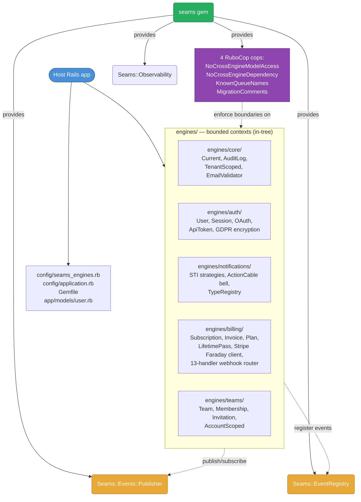
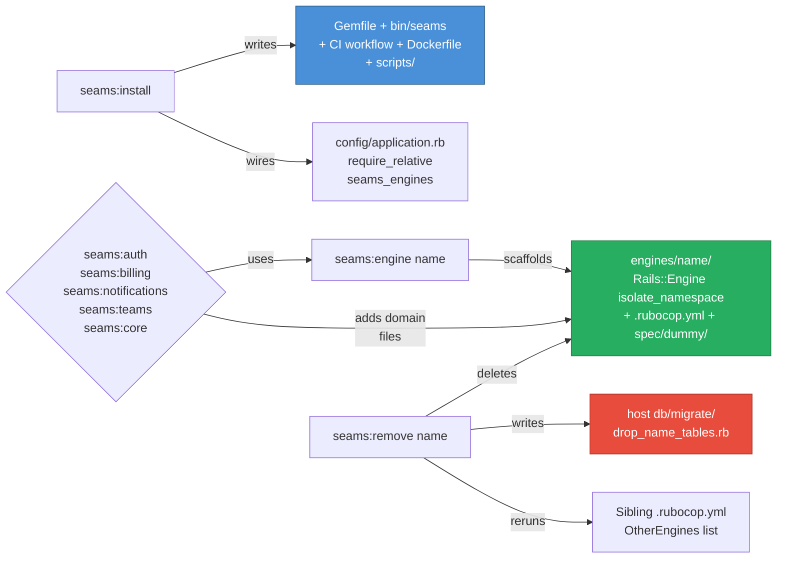

# Architecture review — 2026-05-08

> Snapshot of the seams gem after the six-agent critical review.
> Findings + fixes captured below; the architectural section at the
> end is the durable reference (the kind of doc a new contributor
> reads on day one). Bug-fix commit: [`bacec07`](https://github.com/Davidslv/seams/commit/bacec07).

---

## Method

Six review agents ran in parallel with disjoint scopes:

| Agent | Scope                                     |
| ----- | ----------------------------------------- |
| A     | Cross-engine boundaries + event bus       |
| B     | Security + data integrity                 |
| C     | Billing engine correctness                |
| D     | Test integrity + regression risk          |
| E     | Generator robustness                      |
| F     | Documentation + architectural coherence   |

Each agent had a clear charter, a concrete list of checks, and was
forbidden from modifying files. Output format was standardised:
CRITICAL findings (must fix), RISK findings (defensible-but-flagged),
VERIFIED items (cross-checks that passed).

---

## Findings — what the agents surfaced

### Production-breaking (Agent C)

The Billing engine had four bugs that would have crashed on first
production webhook:

1. `billing_invoices` migration was missing `customer_ref` and
   `subscription_ref` columns that every webhook handler, controller,
   service, view, and factory wrote to.
2. `Invoices::SyncService` read top-level `:paid_at`; Stripe moved
   that field into `status_transitions.paid_at` in 2024. The
   on-demand "fresh refresh" path silently nulled the column.
3. `SubscriptionHandlerBase` never persisted `current_period_end`
   despite the column, the show view, and the factory all expecting
   it.
4. The `billing_webhook_events` factory referenced a non-existent
   `payload` column.

All four fixed in `bacec07`.

### Generator robustness (Agent E)

Six bugs in the generator pipeline that would either silently
mis-mount engines, delete the wrong route lines on remove, or admit
path-traversal names:

1. `host_inject_mount` substring check tripped on prefix collisions
   (`mount Auth::EngineExtras` short-circuited a real `Auth::Engine`
   inject).
2. `host_uninject_mount` regex was prefix-greedy — could delete a
   sibling engine's mount line.
3. `wire_engines_into_application_rb` silently no-op'd on customised
   `application.rb` (Thor warns; the user never sees it).
4. `RemoveGenerator` had no `validate_name`, so
   `seams:remove ../../etc --force` would walk out of the host
   directory.
5. `capture_engine_tables` regex picked up `# create_table :foo`
   line comments as real tables to drop.
6. `host_inject_mount` regex didn't match `do |routes|` block-arg or
   `Rails::Application.routes.draw` forms.

All six fixed.

### Security (Agent B)

Four production-ready security gaps:

1. `auth_users.email` + `auth_oauth_providers.provider_uid` were
   `:string` (VARCHAR(255) on MySQL). The Rails encryption guide
   warns ciphertext exceeds plaintext length; on MySQL hosts the
   cipher would silently truncate and break decryption. Both moved
   to `:text`.
2. `password_min_length` was a configuration knob with no enforcement
   anywhere — `has_secure_password` only validates presence + bcrypt's
   72-byte ceiling. Single-char passwords were admitted. Added
   `validates :password, length: { minimum: ... }`.
3. `Auth::User.authenticate` had a 100ms timing oracle (cost-12
   bcrypt on hit, ~5ms on miss). Pre-computed a frozen
   `DUMMY_PASSWORD_DIGEST` and run a no-op `BCrypt::Password.is_password?`
   on miss so both paths take the same wall-clock time.
4. The `seams:auth:rotate_pii_encryption` rake task aborted on the
   first legacy row that failed today's email regex, leaving every
   row after that one plaintext. Now rescues per row, accumulates
   failures, and aborts at the end if any failed (so the operator
   knows not to flip `support_unencrypted_data` back to `false`).

### Cross-engine + docs (Agents A + F)

- `seams:list` scanned only `engine.rb` for subscriptions, but every
  shipped engine wires subscribers via `attach_once` inside
  `app/subscribers/*.rb`. The CLI was silently reporting zero
  subscriptions for every engine — fixed by scanning both files and
  recognising both `Publisher.subscribe` and `Publisher.attach_once`.
- `api_token.revoked.auth` was registered + documented but had no
  publisher. Shipped a `RevokeApiToken` service.
- Billing README's events table listed 5 of 16 events. Updated to
  the full set including `subscription.trial_will_end`,
  `invoice.created/finalized/voided`, `payment.succeeded/failed`,
  `charge.refunded`, `checkout.session_completed`, and the three
  `lifetime.*` events.
- Notifications README's "Events consumed" table was missing the two
  LTD subscriptions on `BillingSubscriber`. Added.
- `WRITING_AN_ADAPTER.md` documented a non-existent `deliver(_to:,
  _subject:, _body:)` Notifications signature; the actual contract is
  `deliver(notification:)`. Rewrote the example.
- `GETTING_STARTED.md` mis-located `seams_engines.rb` as
  `config/initializers/seams_engines.rb`; actual path is
  `config/seams_engines.rb`. Fixed.
- `WAVE_11_PII_GDPR.md` was still labelled "planning notes — not
  yet implemented". Re-labelled.

### Risks left open

The agents surfaced ~30 RISK-level findings that aren't bugs but are
worth tracking. Highlights:

- **`attach_once` survives Rails autoreload but freezes the original
  method body**: subscribers re-define their `handle_signed_up` and
  the new code never runs until a full server restart. This is a real
  developer-experience bug; the fix is non-trivial (re-resolve the
  constant at call time rather than capturing the singleton-class
  binding) — kept as a follow-up.
- **`MigrationComments` cop produces false negatives** when any other
  comment precedes the migration class. Fix would re-anchor the cop
  on `processed_source.ast_with_comments` rather than line scans.
- **Webhook handler upsert race**: two concurrent retries of the same
  event can race past `find_or_initialize_by`; one publish
  short-circuits via the unique-index rescue, but the other publishes
  on stale data. Subscribers must already be idempotent for the
  current dedupe scheme; documenting the contract more loudly is the
  follow-up.
- **`Customers::FindOrCreateService` is racey** because Stripe's
  customer-search index is eventually consistent. Two near-simultaneous
  signups for the same email yield two `cus_*`. Fix: add a Stripe
  `Idempotency-Key` header per `<email>:<host_user_id>`.
- **`Plan#max_lifetime_units` enforcement is unlocked**: 100 simultaneous
  buyers of the last LTD seat all pass the count check before any
  insert. Fix: `Plan.transaction { plan.lock!; ... }`.
- **Test coverage gaps for the 13 webhook handlers**: only generator
  specs assert their file contents; no runtime spec instantiates a
  handler and asserts the database changed.

These are tracked as RISK in the agent reports preserved in the
session log; they don't block shipping.

### Coverage statistics post-fix

| Tier                                       | Count |
| ----                                        | --- |
| Gem unit specs                              | 506 |
| Integration_full (real `rails new` scaffold) | 2 |
| Per-engine runtime specs (templates)        | 9 |
| RuboCop offences                            | 0 |

---

## Architecture — the durable reference

### System overview



The seams gem itself is small. Its job is to provide a CLI scaffold,
an event bus, a structured-logging adapter, and four RuboCop cops.
The interesting code lives in the engines it generates — and those
engines live in the host's repo, owned by the host, not behind a gem
boundary. This is deliberate: seams is the substrate, not a runtime
dependency tree.

### Cross-engine communication

```mermaid
sequenceDiagram
    autonumber
    participant Stripe
    participant WC as Billing::WebhooksController
    participant WE as WebhookEvent (DB)
    participant ER as Webhooks::EventRouter
    participant H  as Webhooks::Handlers::*
    participant Sub as Billing::Subscription (DB)
    participant Bus as Seams::Events::Publisher
    participant NS as Notifications::BillingSubscriber
    participant Job as CreateNotificationJob
    participant N as Notifications::Notification (DB)

    Stripe->>WC: POST /billing/webhooks/stripe
    WC->>WC: verify_webhook (HMAC-SHA256, 5-min tolerance)
    WC->>WE: create!(gateway_event_id, type)
    Note over WC,WE: unique-index dedupes Stripe retries
    WC->>ER: handler_for(event[:type])
    ER-->>WC: SubscriptionCreatedHandler
    WC->>H: SubscriptionCreatedHandler.new(event:, gateway:).call
    H->>Sub: find_or_initialize_by(gateway_ref:); save!
    Note over H,Sub: customer_ref, plan_ref, status,<br/>current_period_end persisted
    H->>Bus: publish("subscription.created.billing", payload)
    Bus->>NS: handle(payload)
    NS->>Job: perform_later(owner_class:"User", owner_id:, template:, strategy:)
    Job->>N: create!(owner:, template:, type:)
    Note over Bus,Job: dispatch is in-process;<br/>subscribers always enqueue<br/>jobs (never inline DB writes)
```

The contract is: Stripe → controller verifies signature →
WebhookEvent insert (idempotency) → EventRouter looks up the right
handler class → handler upserts the local mirror + publishes the
canonical seams event. Cross-engine subscribers receive a stable
payload shape and *always enqueue an Active Job* rather than running
side effects inline (because the publisher's adapter — currently
ActiveSupport::Notifications — fires callbacks in the publisher's
thread).

Canonical payload shapes:

```
Auth events    → { auth_user_id:, host_user_id:, session_id?:, email?: }
Billing events → { gateway:, livemode:, customer_ref:, ref:, object_id:, object: }
Teams events   → { team_id:, membership_id?:, invitation_id?:, user_id?: }
Notif events   → { notification_id:, owner_class:, owner_id:, template: }
```

The trailing segment of every event name names the emitter:
`subscription.created.billing` is owned by the Billing engine,
`user.signed_up.auth` by Auth. `Seams::EventRegistry` enforces this
— two engines registering the same event name raise
`Seams::Events::DuplicateEventError`.

### Engine boundaries

```mermaid
graph LR
    subgraph Auth["Auth engine"]
        AuthUser[Auth::User]
        AuthSession[Auth::Session]
        ApiToken[Auth::ApiToken]
        OAuthProvider[Auth::OAuthProvider]
        AuthA[Auth::Authenticatable<br/>EXPOSED CONCERN]
    end

    subgraph Billing["Billing engine"]
        Sub[Billing::Subscription]
        Inv[Billing::Invoice]
        Plan[Billing::Plan]
        LP[Billing::LifetimePass]
        BillingA[Billing::Billable<br/>EXPOSED CONCERN]
    end

    subgraph Teams["Teams engine"]
        Team[Teams::Team]
        Membership[Teams::Membership]
        Invitation[Teams::Invitation]
        TeamsA[Teams::Teamable<br/>Teams::AccountScoped<br/>EXPOSED CONCERNS]
    end

    subgraph Notif["Notifications engine"]
        Notification[Notifications::Notification<br/>STI base]
        InApp[Strategies::InApp]
        Email[Strategies::Email]
        Sms[Strategies::Sms]
        AuthSub[AuthSubscriber]
        BillingSub[BillingSubscriber]
        Channel[NotificationChannel<br/>ActionCable]
    end

    HostUser[Host::User<br/>app/models/user.rb]

    HostUser -.includes.-> AuthA
    HostUser -.includes.-> BillingA
    HostUser -.includes.-> TeamsA

    AuthSub -.subscribes to user.signed_up.auth.-> AuthUser
    BillingSub -.subscribes to subscription.*.billing.-> Sub
    BillingSub -.subscribes to invoice.*.billing.-> Inv
    BillingSub -.subscribes to lifetime.*.billing.-> LP

    style AuthA fill:#e8a838,stroke:#b07828,color:#fff
    style BillingA fill:#e8a838,stroke:#b07828,color:#fff
    style TeamsA fill:#e8a838,stroke:#b07828,color:#fff
```

Engines never touch each other's models directly. The only
cross-engine touchpoints are:

1. **Exposed concerns** (e.g. `Auth::Authenticatable`,
   `Billing::Billable`, `Teams::Teamable`) — listed in each engine's
   own `.rubocop.yml` under `ExposedConcerns:`. Host code can
   `include` them; the `Seams/NoCrossEngineModelAccess` cop
   allowlists them per-engine.
2. **Canonical events** — the documented payload shapes above.
3. **The host's `User` model** — every canonical engine stores its
   own ID and a `host_user_id` so cross-engine subscribers can
   resolve the host user without joining across engine schemas.

Direct model access (`::Billing::Subscription` from inside Auth code)
is rejected at lint time by the boundary cops.

### Generator pipeline



`seams:install` lays down host infra. `seams:engine <name>` produces
a generic engine skeleton. The five canonical generators (`auth`,
`billing`, `notifications`, `teams`, `core`) each call
`EngineGenerator.start` first, then add domain templates. `seams:remove`
deletes the engine directory, generates a drop-table migration in the
host, and updates every surviving engine's `.rubocop.yml`.

Idempotence guarantees: gem injection and mount injection are
name-only checks (skip if the line is already present); include
injection is line-anchored. Re-running a canonical generator on an
existing engine fast-fails at `validate_name` — there is no in-place
upgrade path; users `seams:remove` then re-generate.

### Security model

Three trust boundaries:

1. **Encryption boundary**. PII (`Auth::User#email`,
   `Auth::OAuthProvider#provider_uid`) and credentials
   (`access_token`, `refresh_token`) cross into
   `ActiveRecord::Encryption` columns at the model layer.
   Deterministic mode where lookups are needed; non-deterministic
   for write-only credential columns. Backing storage is `:text` to
   accommodate ciphertext expansion (post review fix).

2. **Webhook signature boundary**. Stripe webhooks land at
   `Billing::WebhooksController#stripe`. The body is treated as
   untrusted until `Billing::Stripe::WebhookSignature.verify`
   (HMAC-SHA256, 5-minute timestamp tolerance, multiple `v1=` for
   key rotation, `OpenSSL.fixed_length_secure_compare`). After
   verification, the event is recorded in `WebhookEvent` (unique
   index dedupes Stripe retries) and routed to a handler.

3. **Session / API-token boundary**. Cookie sessions are encrypted
   via Rails' default mechanism. API tokens are issued via
   `GenerateApiToken` (plaintext returned once; only SHA-256 digest
   stored). `ApiAuthenticatable` concern parses Bearer headers.
   OAuth state tokens are 256-bit, used-once, stored in the
   encrypted Rails session.

### Test architecture

Three concentric rings:

1. **Inner**: `spec/seams/` — unit specs for the gem's own code
   (cops, CLI, registry, publisher, observability, generators
   support). 114 examples.
2. **Middle**: `spec/generators/`, `spec/integration/` — generator
   content checks (template files contain expected strings) plus
   in-process multi-generator collision tests. 379 examples.
3. **Outer**: `spec/integration_full/` — tagged
   `type:integration_full`, excluded from the default run. Does a
   real `rails new`, bundle installs, generates every canonical
   engine, runs the engines' `spec/runtime/*` specs against a real
   Postgres dummy, then publishes events through the host's full
   Rails stack and asserts the cross-engine wiring fires. 2
   examples (slow but high-signal).

The Phase 2C / 3B / 4A integration assertions in `rails_new_spec`
exercise the full event chain: register a host user → publish
`user.signed_up.auth` → `AuthSubscriber` enqueues
`CreateNotificationJob` → job runs inline → `Notifications::Notification`
row exists with the right owner. Same shape for billing
(`invoice.paid.billing`) and teams (`team.created.teams`).

### Configuration and extension points

The published extension points hosts are expected to use:

- `Seams::EventRegistry.register(name, emitted_by:)` — declare events
  this engine emits.
- `Seams::Events::Publisher.attach_once(key, name) { |payload| ... }`
  — subscribe; idempotent across Rails autoreload.
- `Billing::Webhooks::EventRouter.register(stripe_type, handler_class)`
  — route a custom Stripe event to a host handler without forking the
  engine.
- `Notifications::TypeRegistry.register(name, template:, channels:,
  display:)` — declare a typed notification.
- Configure-time class strings: `Auth.configuration.oauth_providers`,
  `Billing.configuration.gateway`, `Notifications.configuration.email_adapter`,
  `Notifications.configuration.sms_adapter`. **Caveat surfaced by
  Agent B**: these are `constantize`'d, so do NOT pipe user input
  into them.

---

## What's still pending

After this review wave, these are the open items in
[issue #5](https://github.com/Davidslv/seams/issues/5):

- **Phase 4B (Admin engine)** — deferred per standing decision
  ("use ActiveAdmin or Avo").
- **Phase 5D regeneration of seams-example** with the new generator
  flags — manual operator step.
- **Phase 6 manual operator verifications** — Stripe test-mode
  Checkout walkthrough + `docker build` with all engines.
- **Phase 7 launch** — RubyGems publish, marketing page, posts,
  newsletter.
- The **RISK** items from the review (most notably: tighter
  `attach_once` reload semantics, `MigrationComments` cop accuracy,
  Stripe customer-creation idempotency-key, `Plan#max_lifetime_units`
  pessimistic lock, runtime-spec coverage for the 13 webhook
  handlers).
